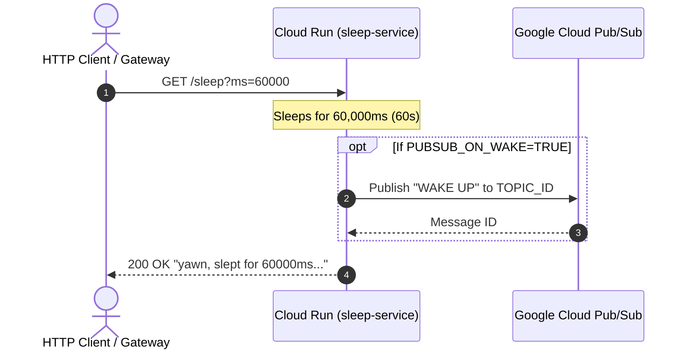

# Sleep Service 😴

A lightweight, high-performance Go microservice designed for testing long-running HTTP calls, timeout configurations, latency behavior, and event-driven wakeups (via Pub/Sub) on **Google Cloud Run** and local development environments.

---

## 💡 Overview

When building cloud-native architectures, API gateways, or microservices, setting proper timeout limits and handling slow or unresponsive backends is critical. `sleep-service` allows developers and site reliability engineers (SREs) to easily mock controllable latencies and verify timeout handling across:

- **Google Cloud Run Request Timeouts** (configurable up to 60 minutes)
- **API Gateways & Load Balancers** (Apigee, Cloud Load Balancing, NGINX, Envoy, etc.)
- **HTTP Client Libraries** (Go, Node.js, Python, Java retry & circuit breaker policies)
- **Event-Driven Workflows** (Google Cloud Pub/Sub wake-up events upon completion)

---

## ✨ Features

- **Customizable Latency Injection**: Specify precise sleep durations in milliseconds via query parameters (`/sleep?ms=5000`).
- **Pub/Sub Wake-Up Notifications**: Optionally publish a Pub/Sub message upon completing the sleep cycle to test asynchronous/decoupled completion flows.
- **Payload Mocking**: Endpoint to return JSON payloads (simulating LLM completions or large API responses).
- **CORS Enabled**: Pre-configured with wildcard CORS headers (`*`) for cross-origin browser testing.
- **Ultra-Fast & Lightweight**: Built with Go and the [Gin](https://github.com/gin-gonic/gin) web framework for minimal overhead and small memory footprint.

---

## 🛠️ Architecture & Flow



---

## 🚀 Quick Start (Local Development)

### Prerequisites

- [Go](https://go.dev/) 1.26 or later installed locally.

### Running the Service

1. Clone the repository and navigate to the project directory:
   ```bash
   cd sleep-service
   ```

2. Start the HTTP server:
   ```bash
   go run main.go
   ```
   *The service will start listening on port `8080` (or the custom port specified by the `PORT` environment variable).*

3. Test the sleep endpoint:
   ```bash
   # Sleep for 2 seconds (2000 ms)
   curl "http://localhost:8080/sleep?ms=2000"
   ```

---

## 📡 API Endpoints

### 1. `GET /sleep`

Delays response execution for the requested duration before returning an HTTP 200 response.

| Query Parameter | Type | Default | Description |
| :--- | :--- | :--- | :--- |
| `ms` | integer | `500` | Sleep duration in milliseconds |

#### Example Requests
```bash
# Default sleep (500ms)
curl "http://localhost:8080/sleep"

# Custom sleep (5000ms / 5 seconds)
curl "http://localhost:8080/sleep?ms=5000"
```

#### Example Response
```text
yawn, slept for 5000ms and published wakeup message 
```
*(If Pub/Sub is enabled, the published Pub/Sub message ID will be appended to the response)*

---

### 2. `POST /payload`

Returns a JSON payload. If `large.payload.local.json` exists in the working directory, it serves its content (useful for testing response body parsing or payload size handling).

#### Example Request
```bash
curl -X POST "http://localhost:8080/payload"
```

---

## ⚙️ Environment Variables

| Variable | Required | Default | Description |
| :--- | :--- | :--- | :--- |
| `PORT` | Optional | `8080` | Port on which the HTTP server listens. |
| `PUBSUB_ON_WAKE` | Optional | - | Set to `TRUE` to publish a message to Google Cloud Pub/Sub upon waking up. |
| `PROJECT_ID` | Conditional | - | GCP Project ID (required if `PUBSUB_ON_WAKE=TRUE`). |
| `TOPIC_ID` | Conditional | - | GCP Pub/Sub Topic ID (required if `PUBSUB_ON_WAKE=TRUE`). |

---

## ☁️ Deploying to Google Cloud Run

### 1. Configure Environment Variables

Define your GCP target project and region in `.env` or export them in your shell:

```bash
export GOOGLE_CLOUD_PROJECT="your-gcp-project-id"
export GOOGLE_CLOUD_LOCATION="europe-west1"
```

### 2. Build & Deploy

You can deploy directly using the provided [`deploy.sh`](file:///home/tyayers/projects/personal/sleep-service/deploy.sh) script or run the `gcloud` command:

```bash
# Build the Linux binary
GOOS="linux" GOARCH=amd64 go build .

# Deploy to Cloud Run with a 20-minute (1200s) timeout
gcloud beta run deploy sleep-service \
  --source . \
  --no-build \
  --base-image=osonly24 \
  --command=./sleep-service \
  --project $GOOGLE_CLOUD_PROJECT \
  --region $GOOGLE_CLOUD_LOCATION \
  --allow-unauthenticated \
  --timeout=1200
```

> **Note:** The `--timeout=1200` flag configures the Cloud Run request timeout to 20 minutes (1200 seconds). Cloud Run supports request timeouts up to 60 minutes (3600 seconds).

---

## 🧪 Testing Timeout Scenarios on Cloud Run

`sleep-service` is specifically useful for testing timeout thresholds across your cloud architecture. Below are common testing scenarios:

### 1. Testing Upstream Gateway / Load Balancer Timeouts

If an API Gateway (e.g. Apigee, Cloud Load Balancing, NGINX) sits in front of Cloud Run with a 60-second gateway timeout:

```bash
# Request within timeout window (55 seconds) -> Returns 200 OK
curl "https://<your-cloud-run-url>/sleep?ms=55000"

# Request exceeding gateway timeout (65 seconds) -> Returns 504 Gateway Timeout
curl "https://<your-cloud-run-url>/sleep?ms=65000"
```

### 2. Testing Cloud Run Container Request Timeout

Deploy the Cloud Run service with a tight request timeout (e.g. `--timeout=30`), then issue a call that exceeds it:

```bash
# Trigger Cloud Run infrastructure timeout (35s delay on a 30s timeout service)
curl "https://<your-cloud-run-url>/sleep?ms=35000"
# Output: HTTP 504 Gateway Timeout or HTTP 503 Service Unavailable generated by Cloud Run
```

### 3. Testing Client-Side HTTP Timeouts & Circuit Breakers

Configure client applications (Go `http.Client`, Python `requests`, Node `axios`, Java `Resilience4j`) with specific timeout limits (e.g., 5 seconds) and verify how your application handles timeout exceptions, retries, or fallback logic:

```bash
# Induce intentional client timeout
curl --max-time 5 "https://<your-cloud-run-url>/sleep?ms=10000"
```

### 4. Testing Asynchronous / Pub/Sub Workflows

Enable Pub/Sub wakeups on Cloud Run:

```bash
gcloud run services update sleep-service \
  --update-env-vars PUBSUB_ON_WAKE=TRUE,PROJECT_ID=my-project-id,TOPIC_ID=my-topic-id
```

Trigger a long sleep request. When the sleep finishes, `sleep-service` publishes a `"WAKE UP"` message to the designated Pub/Sub topic, allowing you to test downstream async processing pipelines.

---

## 📄 License

MIT
